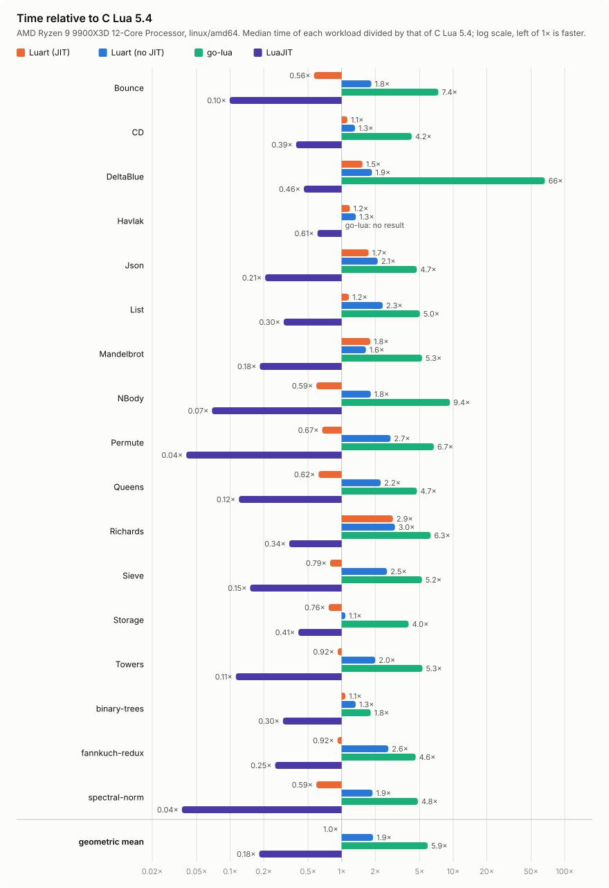

[](https://github.com/matjam/apogee/actions/workflows/ci.yml)
[](https://pkg.go.dev/github.com/matjam/apogee/lua)

# apogee

Apogee is a Lua 5.5 VM in pure Go, built for real-time use such as
per-frame scripts in games, visualisers and audio tools. The name is the
Moon's highest point: Lua is Portuguese for moon. It was called luart
until September 2026.

It began as a fork of [Shopify/go-lua](https://github.com/Shopify/go-lua),
a Lua 5.2 interpreter, and keeps its history, but little of the original
remains: apogee speaks Lua 5.5 rather than 5.2, with integers, `<close>`,
`global` and the 5.5 library; it compiles hot functions to arm64 and
amd64 machine code; its tables, values, calls and collector (weak tables
and finalizers over Go's) are redesigned for speed and for no allocation
per number or call; binary chunks are its own format; and its Go API
follows Lua 5.5's C API, with generics.

## Why

I embed Lua in Go programs I write. go-lua is stable, but it no longer
receives updates, and it leaves a lot of performance on the table. apogee is
also an experiment: I wanted to see how far I could push an interpreter with
generative AI doing the engineering, from modernising the code to writing a
JIT compiler. Quite far, it turns out.

## Goals

- **A complete Lua in Go.** The whole language and standard library,
  behaving as C Lua does, checked by the official test suite, with a
  REPL and command-line interpreter.
- **Speed through JIT compilation.** Hot functions compile to machine code
  on arm64 and amd64, and numbers, booleans and calls never allocate, so a
  script can run every frame without pressure on the garbage collector.
- **Lua 5.5 compatibility.** The current language: integers, bitwise
  operators, `global`, `<const>`, `<close>`, named varargs, `utf8`,
  `string.pack` and 5.5's library.
- **Pure Go, easy to embed.** No cgo and no dependencies in the library,
  an API that reads like Go (typed arguments, generic userdata, number
  functions, `Interrupt`), and the interpreter everywhere the JIT does not
  run.
- **Correct before fast.** Every optimisation is checked against the
  interpreter, and every benchmark against C Lua's results.

## Status

| | |
|---|---|
| Lua version | 5.5; binary chunks are apogee's own format |
| Go | 1.27.1 or later, `CGO_ENABLED=0` |
| API | Methods on `*lua.State`, following Lua's C API and auxiliary library, in `github.com/matjam/apogee/lua`; standard libraries in `github.com/matjam/apogee/stdlib` |
| JIT | linux and darwin on arm64 and amd64; elsewhere, Windows included, states interpret |

- The language and standard library of Lua 5.5 are complete, including
  coroutines (yielding across `pcall`, metamethods and iterators), Lua
  patterns, weak tables and `__gc` finalizers, warnings, `io`, `os`,
  `utf8` and `debug`. `bit32` is gone, as in 5.4.
- The official Lua 5.5 suite runs from `lua-5.5-tests/`, unmodified, and
  every file that does not need C Lua's internal test library passes,
  but for `calls.lua`, which checks C Lua's binary chunk header byte for
  byte ([lua/lua55_test.go](lua/lua55_test.go)).
- With the JIT it is faster than C Lua 5.4 on the standard benchmarks; see
  [Performance](#performance).

Differences from C Lua:

- There is only the C locale, and C modules cannot load: apogee has no
  dynamic libraries.
- Debug information calls Go functions `Go`, not `C`, unless
  `APOGEE_GO_AS_C=1` is set.
- Go's collector frees memory. Weak tables and `__gc` finalizers come
  from a Lua collection that marks the Lua heap, clears weak entries and
  runs finalizers. It runs on `collectgarbage("collect")` or `"step"`,
  and automatically, paced as C Lua paces its collector, in states that
  use weak tables or finalizers. It is not incremental, and an object
  that only Go memory refers to, outside the registry and the stacks,
  counts as garbage. `collectgarbage` cannot stop or tune Go's
  collector, which serves the whole process; `"count"` reports the Go
  heap.
- As in C, files a script opens are buffered, and `os.exit` flushes them;
  a host that ends its process otherwise should call `State.Close`.

## Performance

[`bench/`](bench) runs the same Lua in apogee with and without the JIT,
Shopify/go-lua, C Lua 5.4 and LuaJIT, and checks that they all compute
the same results. With the JIT, apogee runs the standard benchmarks (Are
We Fast Yet and three from the Benchmarks Game) faster than C Lua 5.4,
and everything several times faster than go-lua. Each cell is the
geometric mean of each benchmark's time divided by C Lua 5.4's or native
Go's; below 1× is faster. The two machines were measured at different
commits, which [`bench/README.md`](bench/README.md) gives.

<!-- suite-table summary -->
| Geometric mean | Apogee (JIT) | Apogee (no JIT) | go-lua | Lua 5.4 | LuaJIT |
|---|---:|---:|---:|---:|---:|
| Standard benchmarks against C Lua 5.4, AMD Ryzen 9 9900X3D | **0.78×** | 1.8× | 5.9× | 1× | 0.18× |
| Standard benchmarks against C Lua 5.4, Apple M1 Pro | **0.75×** | 1.5× | 4.8× | 1× | 0.20× |
| Embedding workloads against native Go, AMD Ryzen 9 9900X3D | **5.8×** | 12× | 54× | 8.3× | 2.4× |
| Embedding workloads against native Go, Apple M1 Pro | **6.9×** | 13× | 51× | 9.6× | 2.6× |
<!-- /suite-table -->



apogee allocates nothing for numbers, booleans or calls, only the tables,
closures and strings a script creates; go-lua allocates up to millions of
times a run. [`bench/README.md`](bench/README.md) has every benchmark on
both machines, allocations, notes and how to reproduce the results.

## JIT

`lua.NewState()` compiles hot Lua functions to machine code.
`lua.NewState(lua.WithoutJIT())` makes a state that only interprets, and
the environment variable `APOGEE_JIT=off` does that for every state.

- Platforms: linux and darwin on arm64 and amd64. Elsewhere, Windows
  included, states interpret.
- It compiles arithmetic, comparisons and branches, loops, upvalues,
  table fields (through the interpreter's inline caches) and arrays, calls
  and returns between compiled Lua functions, and `math.floor`, `ceil`,
  `sqrt`, `abs`, `sin` and `cos` inline, bit for bit as Go computes them
  (on amd64, `floor` and `ceil` need SSE4.1, and `sin` and `cos` a
  GOAMD64 level below v3).
  Numeric loops run with their variables in registers.
- Compiled code shares the interpreter's stack frames. An instruction it
  cannot run, or a Go call, returns to Go and continues in compiled code
  after it, so every script runs correctly.
- It gains least where a script crosses into Go every few instructions,
  such as creating closures in a loop; see [bench](bench/README.md). A
  function Go calls that returns within a few instructions, such as a
  `table.sort` comparator, is interpreted, which is faster there.
- It pauses while a debug hook is set.
- CI runs the whole test suite with the JIT, with every function compiled
  (`APOGEE_JIT_TEST=1`) on linux/amd64, linux/arm64 and macOS, and
  interpreted (`APOGEE_JIT=off`).

## The apogee command

```sh
go install github.com/matjam/apogee/cmd/apogee@latest
```

`apogee` runs scripts as the standalone `lua` does, with the same options:
`-e`, `-l`, `-i`, `-v`, `-E`, `-` for stdin, the `arg` table, `LUA_INIT`,
and Ctrl-C to interrupt. On a terminal its REPL:

- highlights Lua as you type, and runs a statement when it is complete
  (an unfinished one gets another line; Alt-Enter adds one);
- prints an expression's value, and tables as trees;
- completes globals, fields and methods with Tab, from the running state;
- keeps history in `~/.apogee_history` (`$APOGEE_HISTORY` to move it, or
  empty for none);
- stops a runaway evaluation with Esc or Ctrl-C;
- takes `/help`, `/load file.lua`, `/reset`, `/jit on|off`, `/clear` and
  `/quit`.

When stdin or stdout is not a terminal, `apogee` behaves exactly as `lua.c`
does: it runs piped input as a script, and `-i` gives its plain REPL.

## Usage

```sh
go get github.com/matjam/apogee@latest
```

Import `github.com/matjam/apogee/lua`, the VM and its API, and
`github.com/matjam/apogee/stdlib`, the standard libraries. A host registers
Go functions, loads a script, and calls the script's functions, here once
a frame:

```go
package main

import (
	"fmt"
	"log"

	"github.com/matjam/apogee/lua"
	"github.com/matjam/apogee/stdlib"
)

func main() {
	l := lua.NewState()
	stdlib.Open(l)

	// A Go function the script can call.
	l.Register("greet", func(l *lua.State) int {
		l.PushString("hello, " + l.Arg[string](1))
		return 1
	})

	if err := l.DoString(`
		count = 0
		function frame(t)
		  count = count + 1
		  return greet("frame " .. count), t * 2
		end`); err != nil {
		log.Fatal(err)
	}

	for t := range 3 {
		l.Global("frame")
		l.PushNumber(float64(t))
		if err := l.ProtectedCall(1, 2, 0); err != nil {
			log.Fatal(err)
		}
		message, _ := l.ToString(-2)
		doubled, _ := l.ToNumber(-1)
		fmt.Println(message, doubled) // hello, frame 1 0 ...
		l.Pop(2)
	}
}
```

`Arg[T]` reads an argument as a `float64`, `int`, `string` or `bool`, and
raises a Lua error when it does not convert. Each example below is
[tested](lua/example_test.go) and on
[pkg.go.dev](https://pkg.go.dev/github.com/matjam/apogee/lua#pkg-examples).

**Errors.** A Lua error reaches Go as the error `ProtectedCall` returns,
with the chunk name and line, and the message is left on the stack:

```go
// game.lua: function update(dt) local speed; return speed * dt end
l.Global("update")
l.PushNumber(0.016)
if err := l.ProtectedCall(1, 0, 0); err != nil {
	fmt.Println(err) // runtime error: game.lua:4: attempt to perform arithmetic on a nil value (local 'speed')
	l.Pop(1)
}
```

**Functions of numbers.** A Go function of `float64`s registered with
`RegisterNumberFunction` is called without a Go call frame when every
argument is a number, by the interpreter and by compiled code. It suits
functions a script calls per pixel or per sample:

```go
var canvas [width * height]float64

l.RegisterNumberFunction("set", func(x, y, v float64) {
	canvas[int(y)*width+int(x)] = v
})
```

**Objects with methods.** A Go value becomes a Lua object through
userdata and a metatable whose `__index` table holds its methods, and
`CheckUserData[T]` reads it back with its Go type:

```go
type point struct{ x, y float64 }

l.NewMetaTable("point")
l.NewTable()
l.SetFunctions([]lua.RegistryFunction{{Name: "norm", Function: func(l *lua.State) int {
	p := l.CheckUserData[*point](1, "point")
	l.PushNumber(math.Hypot(p.x, p.y))
	return 1
}}}, 0)
l.SetField(-2, "__index")
l.Pop(1)

l.Register("point", func(l *lua.State) int {
	l.PushUserData(&point{l.Arg[float64](1), l.Arg[float64](2)})
	l.SetMetaTableNamed("point")
	return 1
})
// Lua: print(point(3, 4):norm()) prints 5.0
```

**Choosing libraries.** `stdlib.Open` opens every standard library. A
host that should not give scripts files or processes opens only some:

```go
l := lua.NewState()
for _, lib := range []lua.RegistryFunction{
	{Name: "_G", Function: stdlib.OpenBase},
	{Name: "string", Function: stdlib.OpenString},
	{Name: "math", Function: stdlib.OpenMath},
} {
	l.Require(lib.Name, lib.Function, true)
	l.Pop(1)
}
for _, name := range []string{"dofile", "loadfile"} { // they read files
	l.PushNil()
	l.SetGlobal(name)
}
```

**Stopping a runaway script.** `Interrupt` may be called from any
goroutine. The running code stops with the error `interrupted!` at its
next loop iteration or tail call, as the standalone `lua` does on Ctrl-C:

```go
time.AfterFunc(100*time.Millisecond, l.Interrupt)
err := l.DoString(`while true do end`) // runtime error: [string "while true do end"]:1: interrupted!
```

**Without the JIT.** `lua.NewState(lua.WithoutJIT())` makes a state that
only interprets; see [JIT](#jit).

## Development

```sh
go test ./...
cd bench && go test -bench . -benchmem
```

C Lua 5.5 (`brew install lua`) is the reference for behaviour the suites
do not pin down.

## Licence

MIT, with Shopify's original go-lua copyright retained. See [LICENSE](LICENSE).
