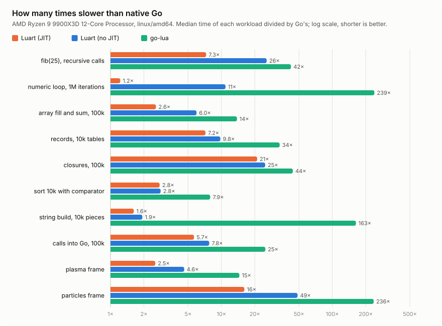
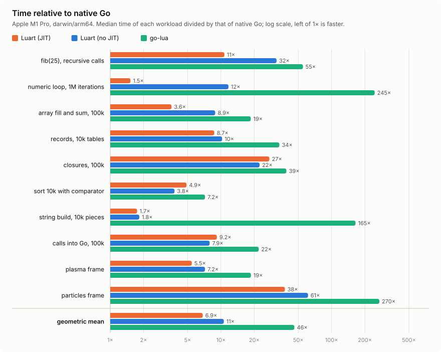
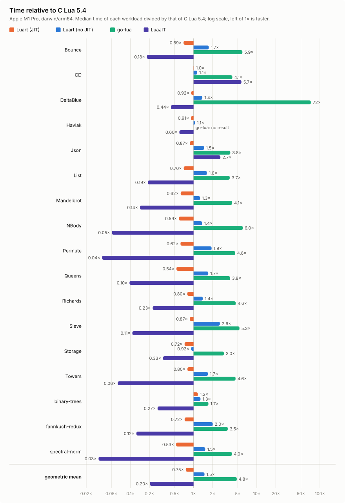

# Benchmarks

Two benchmarks run the same Lua source in every interpreter: luart without
the JIT (`WithoutJIT`), luart with it (the default), Shopify/go-lua, and C
Lua 5.4 or LuaJIT when built with their tag (see
[C interpreters](#c-interpreters)).

- **`BenchmarkSuite`** ([`suite_test.go`](suite_test.go)) runs eleven
  workloads chosen for what an embedded Lua does: calls, loops, tables,
  closures, sorting, building and scanning strings, and calls into Go.
  Each is also written in native Go, which the interpreters are compared
  with.
- **`BenchmarkStandard`** ([`standard_test.go`](standard_test.go)) runs the
  14 benchmarks of Are We Fast Yet and three from the Computer Language
  Benchmarks Game, which other language implementations are measured with
  ([`standard/`](standard)). The interpreters are compared with C Lua 5.4.

`TestSuiteAgrees` and `TestStandardAgrees` check that every interpreter
computes the same results. The tables and charts come from the raw output
by [`chart`](chart) (see [Reproducing](#reproducing)).

## amd64

AMD Ryzen 9 9900X3D, linux, Go 1.27.1, `-count 6`,
`-ldflags=-funcalign=64`, medians, 2026-09-25, at commit e5ed0e4. Lua 5.4.9
and LuaJIT 2.1.1788460057 from Arch Linux's packages. Raw output:
[`suite-results-amd64.txt`](suite-results-amd64.txt).

### The suite



Each cell is the median time, and in brackets that time divided by native
Go's.

<!-- suite-table amd64 -->
| Workload | Native Go | Luart (JIT) | Luart (no JIT) | go-lua | Lua 5.4 | LuaJIT |
|---|---:|---:|---:|---:|---:|---:|
| fib(25), recursive calls | 0.21 ms | 1.58 ms (7.4×) | 5.66 ms (27×) | 9.16 ms (43×) | 2.34 ms (11×) | 0.28 ms (1.3×) |
| numeric loop, 1M iterations | 0.79 ms | 0.95 ms (1.2×) | 9.22 ms (12×) | 185 ms (235×) | 4.52 ms (5.7×) | 0.78 ms (0.99×) |
| array fill and sum, 100k | 0.47 ms | 1.03 ms (2.2×) | 2.59 ms (5.5×) | 5.92 ms (12×) | 0.77 ms (1.6×) | 0.20 ms (0.42×) |
| records, 10k tables | 0.09 ms | 0.62 ms (6.9×) | 0.88 ms (9.8×) | 2.82 ms (31×) | 0.87 ms (9.7×) | 0.28 ms (3.1×) |
| closures, 100k | 0.22 ms | 4.74 ms (21×) | 5.31 ms (24×) | 9.65 ms (43×) | 6.75 ms (30×) | 3.44 ms (15×) |
| sort 10k with comparator | 1.29 ms | 3.59 ms (2.8×) | 3.71 ms (2.9×) | 11.1 ms (8.6×) | 3.28 ms (2.5×) | 3.36 ms (2.6×) |
| string build, 10k pieces | 0.37 ms | 0.56 ms (1.5×) | 0.69 ms (1.9×) | 78.8 ms (212×) | 0.95 ms (2.5×) | 0.37 ms (0.99×) |
| string scan, 11k characters | 0.007 ms | 0.57 ms (84×) | 1.51 ms (224×) | 2.76 ms (409×) | 0.71 ms (105×) | 0.06 ms (8.9×) |
| calls into Go, 100k | 0.22 ms | 1.30 ms (5.8×) | 1.79 ms (8.0×) | 5.43 ms (24×) | 1.09 ms (4.9×) | 0.71 ms (3.2×) |
| plasma frame | 0.30 ms | 0.75 ms (2.5×) | 1.37 ms (4.6×) | 4.20 ms (14×) | 1.48 ms (5.0×) | 0.54 ms (1.8×) |
| particles frame | 0.005 ms | 0.08 ms (16×) | 0.26 ms (50×) | 1.25 ms (239×) | 0.14 ms (27×) | 0.03 ms (5.6×) |
| **geometric mean** |  | **5.8×** | **12×** | **54×** | **8.3×** | **2.4×** |
<!-- /suite-table -->

### The standard benchmarks


Each cell is the median time, and in brackets that time divided by C Lua
5.4's.

<!-- suite-table standard-amd64 -->
| Benchmark | Lua 5.4 | Luart (JIT) | Luart (no JIT) | go-lua | LuaJIT |
|---|---:|---:|---:|---:|---:|
| Bounce | 0.28 ms | 0.16 ms (0.57×) | 0.53 ms (1.9×) | 2.16 ms (7.6×) | 0.03 ms (0.10×) |
| CD | 36.9 ms | 37.0 ms (1.0×) | 45.7 ms (1.2×) | 156 ms (4.2×) | 14.3 ms (0.39×) |
| DeltaBlue | 20.8 ms | 19.9 ms (0.96×) | 32.5 ms (1.6×) | 1414 ms (68×) | 9.55 ms (0.46×) |
| Havlak | 1727 ms | 1744 ms (1.0×) | 2184 ms (1.3×) | – | 1037 ms (0.60×) |
| Json | 4.31 ms | 4.32 ms (1.0×) | 7.78 ms (1.8×) | 20.8 ms (4.8×) | 0.91 ms (0.21×) |
| List | 0.23 ms | 0.17 ms (0.72×) | 0.43 ms (1.9×) | 1.07 ms (4.7×) | 0.07 ms (0.29×) |
| Mandelbrot | 128 ms | 110 ms (0.85×) | 211 ms (1.6×) | 683 ms (5.3×) | 23.7 ms (0.18×) |
| NBody | 1.18 ms | 0.70 ms (0.59×) | 2.19 ms (1.9×) | 11.2 ms (9.4×) | 0.08 ms (0.07×) |
| Permute | 0.39 ms | 0.23 ms (0.61×) | 1.07 ms (2.8×) | 2.44 ms (6.3×) | 0.01 ms (0.04×) |
| Queens | 0.30 ms | 0.17 ms (0.59×) | 0.64 ms (2.2×) | 1.36 ms (4.6×) | 0.03 ms (0.12×) |
| Richards | 16.3 ms | 16.0 ms (0.98×) | 27.2 ms (1.7×) | 99.8 ms (6.1×) | 5.65 ms (0.35×) |
| Sieve | 0.12 ms | 0.09 ms (0.78×) | 0.30 ms (2.5×) | 0.60 ms (5.2×) | 0.02 ms (0.15×) |
| Storage | 0.81 ms | 0.61 ms (0.75×) | 0.90 ms (1.1×) | 3.17 ms (3.9×) | 0.33 ms (0.41×) |
| Towers | 0.75 ms | 0.48 ms (0.64×) | 1.54 ms (2.0×) | 4.17 ms (5.6×) | 0.09 ms (0.12×) |
| binary-trees | 118 ms | 130 ms (1.1×) | 160 ms (1.3×) | 218 ms (1.8×) | 34.9 ms (0.29×) |
| fannkuch-redux | 69.2 ms | 63.5 ms (0.92×) | 182 ms (2.6×) | 318 ms (4.6×) | 18.0 ms (0.26×) |
| spectral-norm | 35.7 ms | 20.6 ms (0.58×) | 65.9 ms (1.8×) | 169 ms (4.7×) | 1.29 ms (0.04×) |
| **geometric mean** |  | **0.78×** | **1.8×** | **5.9×** | **0.18×** |
<!-- /suite-table -->

- luart with the JIT takes 0.78 times as long as C Lua 5.4 on the
  geometric mean. It is faster on 13 of the 17, most on numeric code and
  method calls (spectral-norm, Bounce, Queens and NBody), within 1% on
  CD, Havlak and Json, and 1.1 times as long on binary-trees, which
  allocates most.
- Without the JIT, luart takes 1.8 times as long as C Lua 5.4.
- LuaJIT is 5.5 times faster than C Lua 5.4 on the geometric mean.
- go-lua takes six times as long as C Lua 5.4, and 70 times on
  DeltaBlue. It does not finish Havlak in ten minutes, so it has no result
  there, and its geometric mean is of the other 16.

## arm64

Apple M1 Pro, macOS, Go 1.27.1, `-count 6`, `-ldflags=-funcalign=64`,
medians, 2026-09-25, at commit d5dba73. Lua 5.4.9 and LuaJIT 2.1.1788856981
from Homebrew (`lua@5.4`, `luajit`). The machine was not idle, so single
results vary more than on amd64. Raw output:
[`suite-results.txt`](suite-results.txt).

### The suite



Each cell is the median time, and in brackets that time divided by native
Go's.

<!-- suite-table arm64-m1 -->
| Workload | Native Go | Luart (JIT) | Luart (no JIT) | go-lua | Lua 5.4 | LuaJIT |
|---|---:|---:|---:|---:|---:|---:|
| fib(25), recursive calls | 0.25 ms | 2.76 ms (11×) | 8.22 ms (32×) | 14.5 ms (57×) | 4.13 ms (16×) | 0.48 ms (1.9×) |
| numeric loop, 1M iterations | 1.19 ms | 1.81 ms (1.5×) | 14.0 ms (12×) | 297 ms (250×) | 11.4 ms (9.5×) | 1.05 ms (0.88×) |
| array fill and sum, 100k | 0.58 ms | 1.64 ms (2.8×) | 4.11 ms (7.0×) | 9.03 ms (15×) | 1.21 ms (2.1×) | 0.40 ms (0.68×) |
| records, 10k tables | 0.13 ms | 1.03 ms (7.9×) | 1.36 ms (10×) | 4.55 ms (35×) | 1.32 ms (10×) | 0.42 ms (3.2×) |
| closures, 100k | 0.35 ms | 9.52 ms (27×) | 8.31 ms (24×) | 14.5 ms (41×) | 9.27 ms (26×) | 5.32 ms (15×) |
| sort 10k with comparator | 1.97 ms | 5.81 ms (3.0×) | 5.66 ms (2.9×) | 14.6 ms (7.4×) | 4.97 ms (2.5×) | 3.97 ms (2.0×) |
| string build, 10k pieces | 0.59 ms | 0.88 ms (1.5×) | 1.07 ms (1.8×) | 109 ms (187×) | 1.74 ms (3.0×) | 0.48 ms (0.82×) |
| string scan, 11k characters | 0.02 ms | 0.86 ms (42×) | 2.31 ms (112×) | 3.47 ms (168×) | 1.09 ms (53×) | 0.10 ms (4.9×) |
| calls into Go, 100k | 0.35 ms | 2.19 ms (6.2×) | 2.82 ms (8.0×) | 7.88 ms (22×) | 1.84 ms (5.2×) | 1.16 ms (3.3×) |
| plasma frame | 0.30 ms | 1.45 ms (4.8×) | 2.13 ms (7.0×) | 5.93 ms (20×) | 2.10 ms (6.9×) | 0.53 ms (1.7×) |
| particles frame | 0.006 ms | 0.19 ms (32×) | 0.38 ms (63×) | 1.65 ms (277×) | 0.26 ms (44×) | 0.06 ms (10×) |
| **geometric mean** |  | **6.9×** | **13×** | **53×** | **9.4×** | **2.5×** |
<!-- /suite-table -->

- Sort with a comparator runs about as fast with the JIT as without it.
  Go calls the comparator, which returns after two instructions, so it
  is interpreted: entering compiled code and returning to Go costs about
  10 ns here, more than the instructions. Entered anyway, it took 6.90
  ms against 5.76 ms.

### The standard benchmarks



Each cell is the median time, and in brackets that time divided by C Lua
5.4's.

<!-- suite-table standard-arm64-m1 -->
| Benchmark | Lua 5.4 | Luart (JIT) | Luart (no JIT) | go-lua | LuaJIT |
|---|---:|---:|---:|---:|---:|
| Bounce | 0.49 ms | 0.34 ms (0.69×) | 0.79 ms (1.6×) | 2.91 ms (5.9×) | 0.09 ms (0.18×) |
| CD | 56.6 ms | 57.3 ms (1.0×) | 64.4 ms (1.1×) | 239 ms (4.2×) | 23.5 ms (0.41×) |
| DeltaBlue | 34.8 ms | 32.3 ms (0.93×) | 48.7 ms (1.4×) | 2428 ms (70×) | 14.7 ms (0.42×) |
| Havlak | 3051 ms | 2811 ms (0.92×) | 3198 ms (1.0×) | – | 1745 ms (0.57×) |
| Json | 7.17 ms | 6.29 ms (0.88×) | 10.7 ms (1.5×) | 28.1 ms (3.9×) | 1.22 ms (0.17×) |
| List | 0.42 ms | 0.29 ms (0.69×) | 0.65 ms (1.5×) | 1.52 ms (3.6×) | 0.08 ms (0.18×) |
| Mandelbrot | 286 ms | 179 ms (0.62×) | 356 ms (1.2×) | 1202 ms (4.2×) | 40.5 ms (0.14×) |
| NBody | 2.58 ms | 1.46 ms (0.57×) | 3.41 ms (1.3×) | 15.1 ms (5.8×) | 0.13 ms (0.05×) |
| Permute | 0.77 ms | 0.48 ms (0.62×) | 1.46 ms (1.9×) | 3.49 ms (4.5×) | 0.02 ms (0.03×) |
| Queens | 0.54 ms | 0.29 ms (0.53×) | 0.90 ms (1.7×) | 1.99 ms (3.7×) | 0.05 ms (0.09×) |
| Richards | 29.1 ms | 24.9 ms (0.85×) | 39.0 ms (1.3×) | 134 ms (4.6×) | 6.46 ms (0.22×) |
| Sieve | 0.18 ms | 0.14 ms (0.80×) | 0.46 ms (2.5×) | 0.89 ms (5.0×) | 0.02 ms (0.11×) |
| Storage | 1.45 ms | 1.04 ms (0.72×) | 1.34 ms (0.93×) | 4.37 ms (3.0×) | 0.47 ms (0.33×) |
| Towers | 1.29 ms | 0.99 ms (0.77×) | 2.14 ms (1.7×) | 6.05 ms (4.7×) | 0.08 ms (0.06×) |
| binary-trees | 188 ms | 216 ms (1.1×) | 242 ms (1.3×) | 335 ms (1.8×) | 48.9 ms (0.26×) |
| fannkuch-redux | 133 ms | 111 ms (0.83×) | 264 ms (2.0×) | 464 ms (3.5×) | 16.9 ms (0.13×) |
| spectral-norm | 62.7 ms | 33.0 ms (0.53×) | 93.3 ms (1.5×) | 254 ms (4.0×) | 1.98 ms (0.03×) |
| **geometric mean** |  | **0.75×** | **1.5×** | **4.8×** | **0.15×** |
<!-- /suite-table -->

- luart with the JIT takes 0.75 times as long as C Lua 5.4 on the
  geometric mean, and is faster on 15 of the 17; CD takes as long, and
  binary-trees, which allocates most, 1.1 times as long.
- Without the JIT, luart takes 1.5 times as long as C Lua 5.4.
- Relative to C Lua 5.4, both luart and LuaJIT do better here than on
  amd64. The two machines' C Lua 5.4 are different builds (Homebrew and
  Arch Linux), so compare their ratios with care.

## Allocations

The JIT allocates exactly what the interpreter does. Allocations are per
run of each suite workload.

| Workload | luart allocations | go-lua allocations |
|---|---|---|
| fib(25) | 0 | 318,000 |
| numeric loop | 0 | 4,857,000 |
| array fill and sum | 22 | 500,000 |
| records | 10,000 | 120,000 |
| closures | 100,000 | 900,000 |
| sort | 17 | 180,000 |
| string build | 10,000 | 80,000 |
| string scan | 0 | 71,000 |
| calls into Go | 0 | 400,000 |
| plasma frame | 0 | 280,000 |
| particles frame | 0 | 25,000 |

## Notes

- Plasma is a 200×100 per-pixel effect with three `math.sin` calls and one
  call into Go per pixel. Particles moves 2,000 particle tables by a method
  and draws them.
- `TestNumericFrameDoesNotAllocate` keeps numeric code and calls into Go
  allocation-free.
- Numbers, booleans and calls allocate nothing in luart. The remaining
  allocations are the Lua objects the script creates, one per table,
  closure or string.
- go-lua's numeric loop is slow because its `%` fast path calls
  `math.Mod`, which is far slower than Lua's `a - floor(a/b)*b`.
- The string scan walks 11,000 characters with `s:byte(i)` and
  `s:sub(i, i)`: two calls into Go a character, which the native Go
  version replaces with indexing its compiler folds into a tight loop. It
  shows what calls into Go cost; luart with the JIT runs it faster than C
  Lua 5.4. It is the suite's newest workload, so its geometric means are
  not comparable with those of earlier runs.
- go-lua's string build is quadratic: its `table.concat` appends with
  `s += str`. luart's uses a `strings.Builder`.
- The JIT gains least where scripts cross between compiled code and Go
  every few instructions: creating closures, Go calling Lua (the sort
  comparator), and calls into Go. It is fastest on numeric loops and Lua
  calls.
- On amd64 most of plasma's time with the JIT is in compiled code, not in
  its calls to `set`: every Lua register lives in memory, and each store
  checks the write barrier flag in memory.
- `-ldflags=-funcalign=64` keeps the interpreter loop's alignment fixed;
  without it, unrelated changes move timings by 5–10%.
- The native Go versions keep Go's advantages, such as inlined method calls
  in particles, so the gap to Go is widest where Go inlines most.
- Plasma here registers `set` as an ordinary Go function. Registered as a
  number function, which compiled code calls without a Go frame, it takes
  0.71 ms with the JIT (`BenchmarkLuartNumberFunction`), against 0.76 ms
  (`BenchmarkLuart`).
- The C interpreters' calls into Go are calls to C functions, and their
  plasma draws into a C array; the suite's other workloads are the same
  Lua in every interpreter. Their results use integers where Lua 5.4 does,
  which the agreement tests compare as numbers.

## C interpreters

C Lua 5.4 and LuaJIT are linked with cgo, so they need a C compiler and
their development packages, found with pkg-config (`lua5.4` and
`luajit`). Both define the Lua C API, so a test binary can link only one.
Each has a build tag: `clua54` or `luajit`. Without either, the benchmarks
build with `CGO_ENABLED=0` and run luart and go-lua only. On macOS,
Homebrew's `lua` is now 5.5; install `lua@5.4`, which is keg-only, and
set `PKG_CONFIG_PATH=$(brew --prefix lua@5.4)/lib/pkgconfig`.

## Reproducing

From this directory, on an idle machine, run luart, go-lua and native Go,
then each C interpreter, into one file:

```sh
CGO_ENABLED=0 go test -run x -bench . -benchmem -count 6 -timeout 3h -ldflags=-funcalign=64 > suite-results-amd64.txt
go test -tags clua54 -run x -bench '.*/.*/lua54$' -benchmem -count 6 -timeout 3h >> suite-results-amd64.txt
go test -tags luajit -run x -bench '.*/.*/luajit$' -benchmem -count 6 -timeout 3h >> suite-results-amd64.txt
go run ./chart -svg suite-amd64.svg -readme README.md -name amd64 suite-results-amd64.txt
go run ./chart -suite standard -svg standard-amd64.svg -readme README.md -name standard-amd64 suite-results-amd64.txt
```

From the median of each benchmark in the file, `-svg` redraws the chart
and `-readme` rewrites the table between `<!-- suite-table NAME -->` and
`<!-- /suite-table -->` in each file; `-table` prints it instead. Name the
file, charts and tables for the machine. On Apple M1 the file is
`suite-results.txt`, and the charts and tables are only in this README:

```sh
go run ./chart -svg suite-arm64-m1.svg -readme README.md -name arm64-m1 suite-results.txt
go run ./chart -suite standard -svg standard-arm64-m1.svg -readme README.md -name standard-arm64-m1 suite-results.txt
```

After either machine's run, `-summary` rewrites the root README's table
of geometric means from both files, a row per benchmark and machine:

```sh
go run ./chart -summary -readme ../README.md -name summary suite-results-amd64.txt suite-results.txt
```
